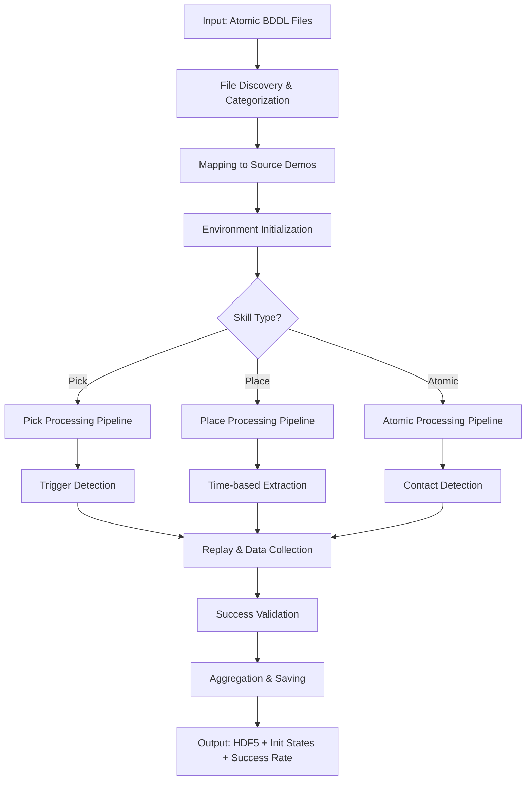
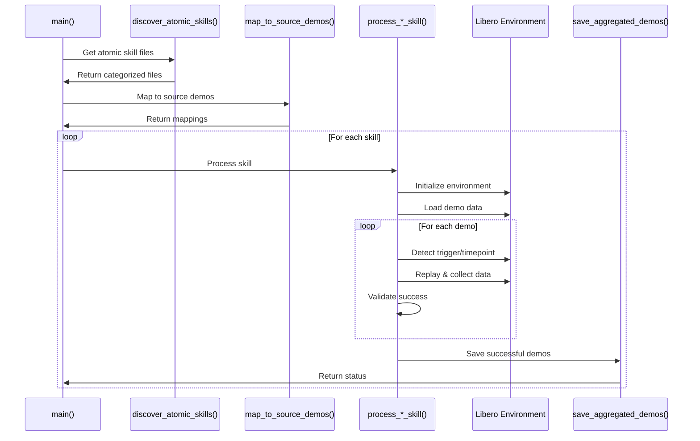
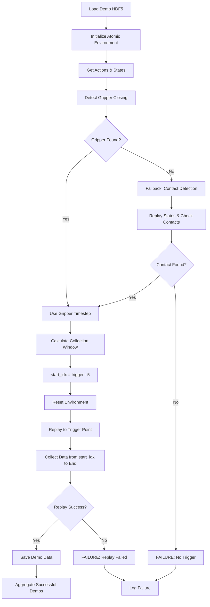
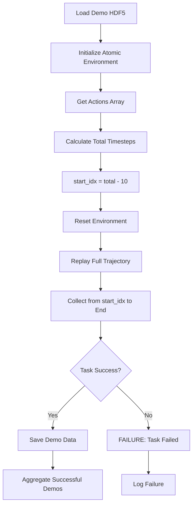
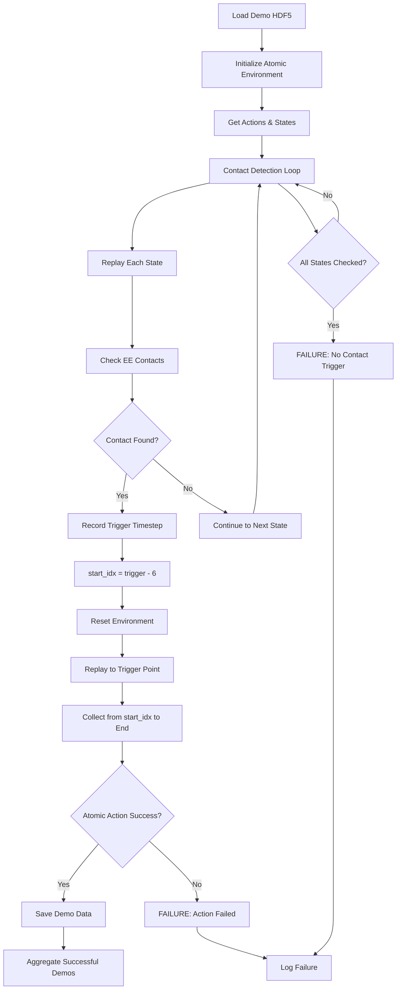
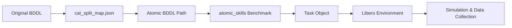

# Atomic Skills Local Demo Generation Pipeline Documentation

This document provides a comprehensive explanation of the logic, functions, and processing steps in `generate_local_demos.py` for the OpenVLA atomic skill learning pipeline.

## 📋 Table of Contents

1. [Overview](#overview)
2. [Pipeline Architecture](#pipeline-architecture)
3. [Skill Processing Logic](#skill-processing-logic)
4. [Function Reference](#function-reference)
5. [Processing Workflows](#processing-workflows)
6. [Data Flow Diagrams](#data-flow-diagrams)

## 🎯 Overview

The `generate_local_demos.py` script extracts "local demos" - short, contact-rich sub-trajectories from long robotic demonstrations for VLA (Visual Language Action) model training. It processes three types of atomic skills with different extraction strategies:

- **Pick Skills** (`*_pick.bddl`): Trigger-based extraction around gripper closing/contact
- **Place Skills** (`*_place.bddl`): Time-based extraction from end of trajectory  
- **Atomic Skills** (no suffix): Contact-based extraction around manipulation events

## 🏗️ Pipeline Architecture



## 🔄 Skill Processing Logic

### Pick Skills Processing (`process_pick_skill`)

**Purpose**: Extract manipulation sequences around gripper closing or contact events.

**Processing Steps**:
1. **Data Loading**: Load source HDF5 demonstration file
2. **Environment Setup**: Initialize libero environment using `atomic_skills` benchmark
3. **Trigger Detection**: Use `detect_trigger_timestep()` to find key events
4. **Replay & Collection**: 
   - Replay trajectory from start to trigger point
   - Collect data from `trigger_timestep - 5` to end of demonstration
5. **Success Validation**: Check `reward > 0` or `env.check_success()`
6. **Data Aggregation**: Combine successful demos into single HDF5 file

**Trigger Detection Logic** (`detect_trigger_timestep`):
```python
# 1. Primary: Gripper closing detection
for i in range(1, len(gripper_commands)):
    if gripper_commands[i - 1] < 0 and gripper_commands[i] > 0:
        return i  # Found gripper closing

# 2. Fallback: End-effector contact detection
for t, sim_state in enumerate(states):
    env.set_init_state(sim_state)
    # Check for contact between EE and environment objects
    if contact_detected:
        return t
```

**Data Collection Window**:
- **Start**: `max(0, trigger_timestep - 5)`
- **End**: End of demonstration
- **Rationale**: Captures approach and execution phases of picking motion

### Place Skills Processing (`process_place_skill`)

**Purpose**: Extract final placement sequences from manipulation demonstrations.

**Processing Steps**:
1. **Data Loading**: Load source HDF5 demonstration file
2. **Environment Setup**: Initialize libero environment using `atomic_skills` benchmark
3. **Time-based Extraction**: No trigger detection required
4. **Replay & Collection**:
   - Replay entire trajectory
   - Collect data from `total_timesteps - 10` to end
5. **Success Validation**: Check task completion criteria
6. **Data Aggregation**: Save successful placement demos

**Collection Window**:
- **Start**: `max(0, total_timesteps - 10)`
- **End**: End of demonstration
- **Rationale**: Captures final placement and release phases

### Atomic Skills Processing (`process_atomic_skill`)

**Purpose**: Extract specific atomic manipulation actions (drawer opening, button pressing, etc.).

**Processing Steps**:
1. **Data Loading**: Load source HDF5 demonstration file
2. **Environment Setup**: Initialize libero environment using `atomic_skills` benchmark
3. **Contact Detection**: Use `detect_trigger_timestep_contact_only()` for contact events
4. **Replay & Collection**:
   - Replay trajectory from start to trigger point
   - Collect data from `trigger_timestep - 6` to end
5. **Success Validation**: Check atomic action completion
6. **Data Aggregation**: Save successful atomic demos

**Contact Detection Logic** (`detect_trigger_timestep_contact_only`):
```python
EE_GEOM_NAMES = [
    "robot0_eef", "robot0_gripper0_finger0", "robot0_gripper0_finger1",
    "gripper0_hand_collision", "gripper0_finger0_collision", "gripper0_finger1_collision"
]

for t, sim_state in enumerate(states):
    env.set_init_state(sim_state)
    for contact in env.sim.data.contact:
        if contact_involves_ee(contact):
            return t  # Found contact trigger
```

**Data Collection Window**:
- **Start**: `max(0, trigger_timestep - 6)`
- **End**: End of demonstration
- **Rationale**: Captures approach and atomic action execution

## 📚 Function Reference

### Core Processing Functions

#### `categorize_skill_file(bddl_filename: str) -> str`
**Purpose**: Categorize BDDL files based on filename suffix.
```python
if bddl_filename.endswith('_pick.bddl'): return 'pick'
elif bddl_filename.endswith('_place.bddl'): return 'place'
else: return 'atomic'
```

#### `discover_atomic_skills(atomic_skills_dir: str, debug: bool) -> List[Tuple[str, str]]`
**Purpose**: Find and categorize all atomic skill BDDL files.
- **Normal Mode**: Returns all BDDL files in directory
- **Debug Mode**: Returns one file per category (pick/place/atomic)

#### `map_to_source_demos(atomic_skills, cat_split_map, raw_demo_dir) -> List[Dict]`
**Purpose**: Map atomic skills to their source demonstration files using `cat_split_map.json`.
```python
mapping_info = {
    'atomic_bddl_path': '/path/to/skill_pick.bddl',
    'category': 'pick', 
    'original_bddl_path': '/path/to/original_task.bddl',
    'demo_filename': 'original_task_demo.hdf5',
    'demo_full_path': '/full/path/to/demo.hdf5',
    'skill_name': 'skill_pick'
}
```

### Data Collection Functions

#### `collect_step_data(action, obs, reward, done, env) -> Dict`
**Purpose**: Collect step data according to `hdf5_structure.md` specifications.
```python
step_data = {
    'actions': action,                              # (7,) - robot action
    'dones': done,                                  # bool - episode termination
    'rewards': reward,                              # float - step reward
    'states': env.sim.get_state().flatten(),        # (N,) - full sim state
    'robot_states': obs['robot0_proprio-state'][:9], # (9,) - robot proprioception
    'obs': {
        'joint_states': obs['robot0_joint_pos'],    # (7,) - joint positions
        'gripper_states': obs['robot0_gripper_qpos'], # (2,) - gripper positions
        'ee_pos': obs['robot0_eef_pos'],            # (3,) - end-effector position
        'ee_ori': R.from_quat(obs['robot0_eef_quat']).as_euler('xyz'), # (3,) - EE orientation
        'ee_states': np.concatenate([...]),          # (6,) - combined pose
        'agentview_rgb': obs['agentview_image'],     # (H,W,3) - third person view
        'eye_in_hand_rgb': obs['robot0_eye_in_hand_image'] # (H,W,3) - wrist camera
    }
}
```

#### `convert_steps_to_demo(step_data_list: List[Dict]) -> Dict`
**Purpose**: Convert list of step data to demo format for HDF5 saving.
- Stacks step data along time dimension
- Converts to appropriate dtypes (uint8 for dones/rewards)

### File I/O Functions

#### `save_aggregated_demos(successful_demos, skill_name, args, demo_keys) -> Tuple[bool, str]`
**Purpose**: Save all successful demonstrations to output files.

**Generated Files**:
1. **HDF5 File** (`{skill_name}_demo.hdf5`):
   ```
   data/
   ├── demo_0/
   │   ├── actions        # (T, 7)
   │   ├── dones          # (T,)
   │   ├── rewards        # (T,)
   │   ├── states         # (T, N)
   │   ├── robot_states   # (T, 9)
   │   └── obs/
   │       ├── joint_states      # (T, 7)
   │       ├── gripper_states    # (T, 2)
   │       ├── ee_pos           # (T, 3)
   │       ├── ee_ori           # (T, 3)
   │       ├── ee_states        # (T, 6)
   │       ├── agentview_rgb    # (T, H, W, 3)
   │       └── eye_in_hand_rgb  # (T, H, W, 3)
   └── demo_1/ ...
   ```

2. **Initial States** (`{skill_name}.init`): Pickle file with initial robot states
3. **Success Rate** (`{skill_name}_success_rate.npy`): Success rate as numpy scalar

## 🔄 Processing Workflows

### Main Processing Workflow



### Pick Skill Detailed Workflow



### Place Skill Detailed Workflow



### Atomic Skill Detailed Workflow



## 📊 Data Flow Diagrams

### Environment Benchmark Flow



**Key Points**:
- **Original Tasks**: Use `libero_90` benchmark for source demonstrations
- **Atomic Tasks**: Use `atomic_skills` benchmark for environment initialization
- **Mapping**: `cat_split_map.json` links original tasks to atomic skill files
- **Environment**: Each atomic skill creates a specific libero environment

### Data Collection Flow

```mermaid
graph TD
    A[Environment Step] --> B[collect_step_data()]
    B --> C[Extract Observations]
    C --> D[Process Images]
    C --> E[Process Robot State]
    C --> F[Process Actions/Rewards]
    
    D --> G[agentview_rgb]
    D --> H[eye_in_hand_rgb]
    E --> I[joint_states, gripper_states]
    E --> J[ee_pos, ee_ori, ee_states]
    F --> K[actions, rewards, dones]
    
    G --> L[Step Data Dict]
    H --> L
    I --> L
    J --> L
    K --> L
    
    L --> M[convert_steps_to_demo()]
    M --> N[Demo Data Arrays]
    N --> O[save_multiple_demos_to_hdf5()]
```

## 🎛️ Configuration Parameters

### Command Line Arguments

| Parameter | Default | Description |
|-----------|---------|-------------|
| `--atomic_skills_dir` | `.../atomic_skills` | Directory with atomic BDDL files |
| `--cat_split_map_file` | `.../cat_split_map.json` | Mapping file |
| `--raw_demo_dir` | `.../libero_90_no_noops/` | Source demonstrations |
| `--output_dir` | `.../atomic_local_demos/` | Output directory |
| `--init_offset` | `3` | Steps before trigger for init state |
| `--debug` | `False` | Debug mode (one file per category) |

### Processing Constants

```python
# Trigger detection offsets
PICK_OFFSET = 5      # trigger - 5 to end
PLACE_OFFSET = 10    # total - 10 to end  
ATOMIC_OFFSET = 6    # trigger - 6 to end

# End-effector geometry names for contact detection
EE_GEOM_NAMES = [
    "robot0_eef", "robot0_gripper0_finger0", "robot0_gripper0_finger1",
    "gripper0_hand_collision", "gripper0_finger0_collision", "gripper0_finger1_collision"
]

# Data collection specifications
ACTION_DIM = 7       # Robot action dimensionality
JOINT_DIM = 7        # Joint position dimensionality
GRIPPER_DIM = 2      # Gripper position dimensionality
ROBOT_STATE_DIM = 9  # Robot proprioception dimensionality
```

## 🔍 Debug Mode

**Purpose**: Test pipeline with minimal data for debugging and validation.

**Behavior**:
- Processes only **one file per skill category** (pick/place/atomic)
- Processes only **first demonstration** in each HDF5 file
- Reduces processing time for quick validation
- Maintains full processing logic for accurate testing

**Usage**:
```bash
python generate_local_demos.py --debug
```

## ⚡ Performance Considerations

### Memory Management
- **Streaming**: Processes one demo at a time to avoid memory issues
- **State Management**: Environments are closed after each skill processing
- **Data Aggregation**: Multiple demos combined efficiently using numpy arrays

### Processing Optimization
- **Early Termination**: Stops replay on task completion (`done=True`)
- **Trigger Detection**: Uses efficient numpy operations for gripper detection
- **Contact Detection**: Minimizes simulation state setting operations

### Error Handling
- **Graceful Failures**: Individual demo failures don't stop batch processing
- **Validation**: Comprehensive input validation for file paths and parameters
- **Logging**: Detailed progress reporting for debugging

## 🎯 Success Criteria

### Pick Skills
- **Trigger Found**: Gripper closing OR end-effector contact detected
- **Replay Success**: `reward > 0` OR `env.check_success() == True`
- **Data Collection**: At least 1 timestep collected after trigger

### Place Skills  
- **Time Window**: Sufficient trajectory length for 10-step extraction
- **Task Success**: `reward > 0` OR `env.check_success() == True`
- **Data Collection**: 10 timesteps collected from end of trajectory

### Atomic Skills
- **Contact Found**: End-effector contact with environment detected
- **Action Success**: `reward > 0` OR `env.check_success() == True`  
- **Data Collection**: At least 1 timestep collected after contact

## 📈 Output Statistics

Each skill generates comprehensive statistics:

- **Success Rate**: `successful_demos / total_demos`
- **Collection Metrics**: Number of timesteps per demo
- **Processing Time**: Time per skill and per demo
- **File Sizes**: HDF5 file sizes and compression ratios

The pipeline provides detailed logging for monitoring performance and debugging issues across all skill types and processing stages.